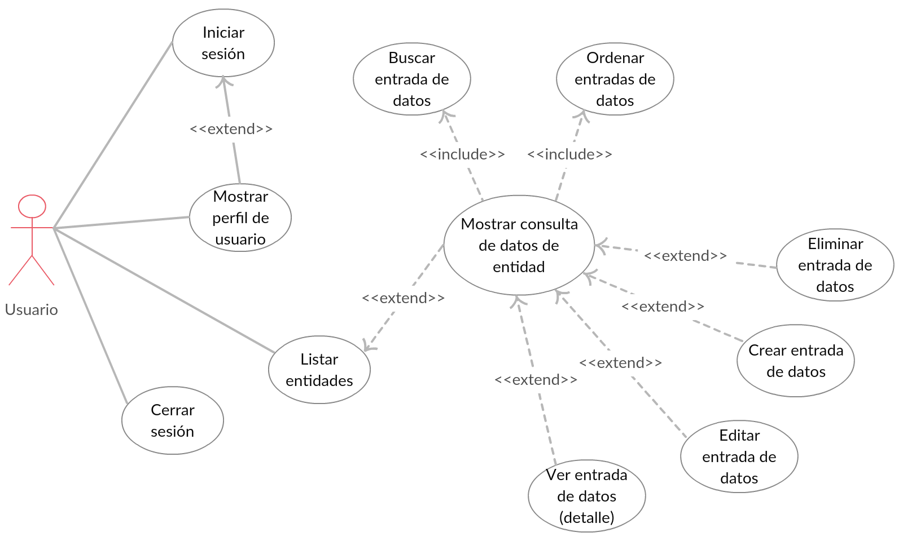

## Explicación
Al entrar el usuario en la aplicación existen dos posibilidades, que el usuario no haya iniciado sesión o que el usuario ya ha visitado la aplicación previamente y su sesión esté activa.

- En caso de que el usuario no haya iniciado sesión podrá acceder únicamente a la página de inicio de sesión. Desde la página de inicio de sesión deberá ingresar su usuario y contraseña. Una vez iniciada la sesión, el usuario será dirigido a la página de perfil de usuario.

- En la página de perfil, el usuario puede consultar los datos pertinentes a su cuenta. Estos datos varían dependiendo de la respuesta de autenticación del servidor.

En el caso de que el usuario haya iniciado sesión podrá decidir entre visitar su perfil, listar las entidades de datos o cerrar sesión.

- Si el usuario elige la opción de listar las entidades, se desplegará un menú mostrando las entidades del sistema. Al seleccionar una entidad, se dirigirá al usuario a la página de consulta de datos de dicha entidad.

- En la página de consulta de datos, el usuario encontrará todas las entradas de datos de la entidad seleccionada contenidas dentro de una tabla. Si lo desea el usuario podrá buscar datos por texto o ordenar la tabla según las distintas columnas. Dependiendo del rol que tenga el usuario, podrá realizar ciertas acciones que afecten a los datos de la entidad. Las acciones posibles son crear, ver, editar o eliminar una entrada de datos.

- Si el usuario elige la acción de ver una entrada de datos, será dirigido a una página de detalle donde se mostrarán los datos que se encontraban en la tabla, y de existir, otros campos adicionales.

- Si el usuario elige la acción de crear, será dirigido a un formulario donde habrá un campo por cada propiedad de la entidad.

- Si el usuario elige la acción de editar, será dirigido al mismo formulario que al crear, con la excepción de que este formulario estará relleno con los datos actuales de la entrada seleccionada.

- Si el usuario elige la acción de eliminar, se mostrará una ventana de confirmación donde podrá cancelar o eliminar la entrada de datos.

Finalmente, en caso de que el usuario elija la opción de cerrar sesión, se eliminará su sesión y se le dirigirá al escenario inicial.
