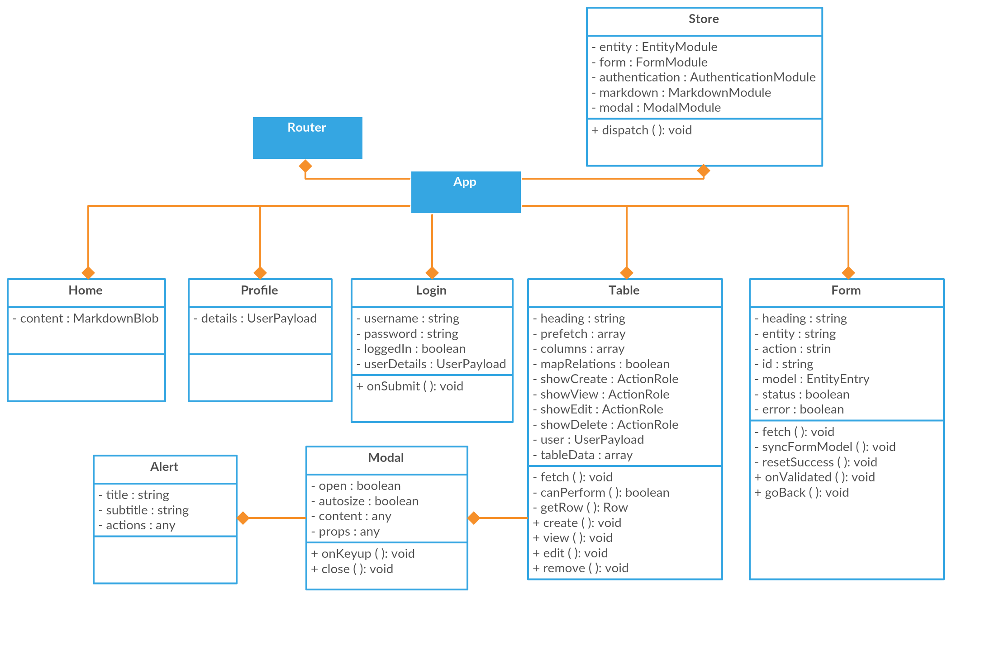
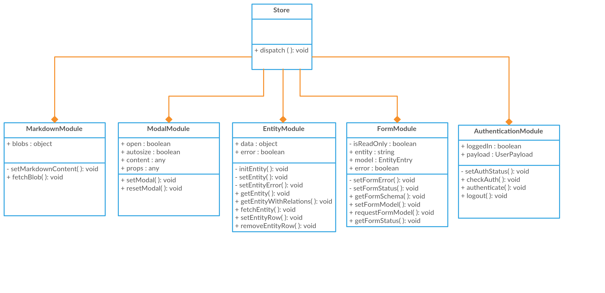

# Diagrama de Clases

## Explicación
La aplicación contiene 5 clases que actúan como controladores, 1 clase que actúa como modelo y 1 clase que actúa como mediador entre la aplicación y los controladores.

### Mediador
_El Mediador promueve bajo acoplamiento asegurándose de que en vez de que los módulos hagan referencia entre ellos de forma explicita, su interacción sea gestionada mediante un punto central. También se puede usar de muchas otras formas como por ejemplo para gestionar permisos; un Mediador puede controlar a que eventos en un sistema se puede suscribir y cuales pueden ser despachados.[4]_

La clase que actúa como mediador es: Router. Esta clase tiene como función decidir que controladores y por lo tanto que vistas deben de mostrarse en la aplicación en todo momento. Además de eso, añade a la aplicación eventos de transición entre vistas.
 
### Controladores
Las clases que actúan como controladores son: Home, Profile, Login, Form, Table. Esta última contiene a su vez otras 2 clases que también actúan como controladores: Modal y Alert.
La función de este tipo de clases es recibir eventos desde la vista y hacer las transformaciones necesarias y despachar un evento a modelo para que este se actualice. Además también se suscribe a los cambios del modelo y actualiza la vista.

### Modelo
El modelo se encarga de la petición, validación y gestión de los datos de la aplicación. El modelo esta subdividido en 5 módulos: MarkdownModule, ModalModule, EntityModule, FormModule y AuthenticationModule.

El MarkdownModule se encarga de descargar y cachear el contenido markdown que se muestra en las páginas de tipo markdown. De momento solo existe una, que es la página de inicio.

El ModalModule se encarga de gestionar el estado de la ventana modal de la aplicación. Puede cambiar la visibilidad de esta y el contenido.

El EntityModule se encarga de inicializar las entidades del sistema, hace peticiones de datos de cada entidad, puede actualizar y eliminar los datos de cada entidad.

El FormModule se encarga del estado de los formularios de la aplicación. Crea o actualiza el modelo de datos del formulario y se encarga de actualizar los datos en el servidor.

El AuthenticationModule se encarga de la lógica de autenticación del sistema. Revisa si el usuario ha iniciado sesión previamente, autentica al usuario contra el servidor y cierra la sesión de usuario.
