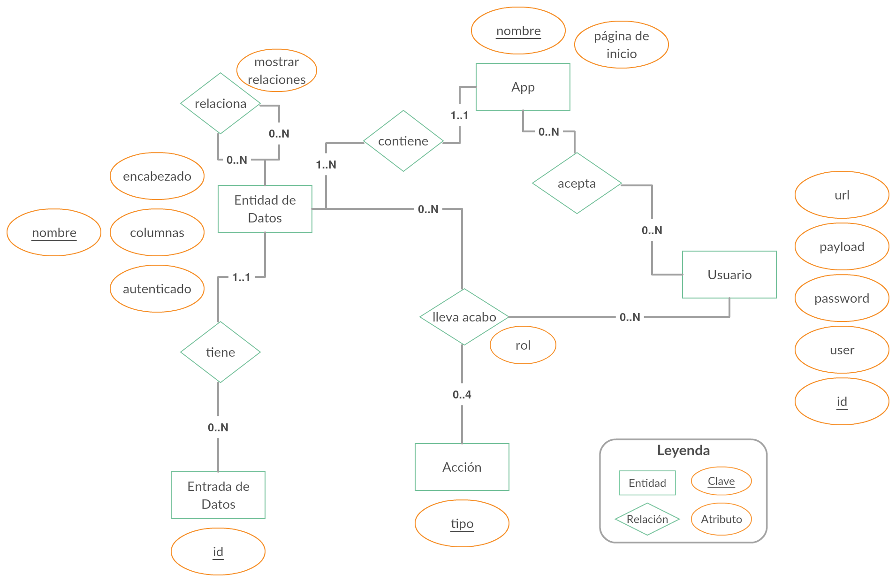

# Modelo de Datos


## Explicación
Para empezar se crea una nueva app, formada por un `nombre` y una `página de inicio`. App se relaciona con Usuario y con Entidad de Datos. Una aplicación puede aceptar desde cero usuarios hasta tantos como sea necesario; y un usuario puede estar aceptado en cero o el número de apps que deseé.
Una app debe contener como mínimo una Entidad de Datos hasta el número que sea necesario; y una Entidad de Datos puede estar contenida en una sola app.

Una Entidad de Datos tiene como atributos: nombre, encabezado, columnas y autenticado. El `nombre` funciona como identificador único, el `encabezado` es el texto que será visible al mostrar la entidad, el atributo `columnas` corresponde a las propiedades de datos que serán mostradas en la tabla de consulta,  el atributo `autenticado` determina si el acceso a la página de la entidad estará protegido por autenticación.

Como mencionamos previamente Entidad de Datos está relacionada con App, pero también esta relacionada con Entrada de Datos, Acción y Usuario.
Una Entidad de Datos puede tener cero o el número que sea necesario de entradas de datos. A su vez, una Entrada de Datos puede pertenecer únicamente a una Entidad de Datos.

Entrada de Datos esta formada por el atributo: `id` que representa un identificador único.

Usuario esta formado por los atributos: `id`, `user` que representa la propiedad a usar como nombre de usuario en la petición al servidor de autenticación, `password` representa la propiedad a usar como contraseña en la petición al servidor de autenticación, `payload` representa la ubicación dentro de la respuesta del servidor de autenticación donde se encuentran los datos de usuario y `url` la dirección web donde la aplicación debe de autenticarse.

Un ejemplo práctico de la tabla de Usuario podría ser:

| user  | password | payload   | url                         |
| ----- | -------- | --------- | --------------------------- |
| email | pass     | data.user | http://api.example.com/auth |

La petición al servidor:
```bash
curl -XPOST -H "Content-type: application/json" -d '{"email": "john@example.com", "pass": "!6376e890bShbksd"}' 'http://api.example.com/auth'
```
La respuesta del servidor:
```json
{
  "data": {
    "user": {
      "id": 1,
      "name": "John",
      "role": "ADMIN"
    }
  }
}
```

Acción esta formada por atributo  `tipo`, que en la práctica puede ser: crear, ver, editar o eliminar. Acción tiene una relación triple con Entidad de Datos y Usuario. Esta se puede definir como: _Usuario_ lleva a cabo _acción_ en _entidad de datos_. Dicha relación tiene un atributo `rol` con el objetivo de determinar que usuario puede llevar acabo una acción en una entidad de datos.

Una acción puede ser llevada ser llevada a cabo por cero o cualquier número de usuarios; un usuario puede llevar a cabo cero hasta el número de acciones soportadas (en este caso 4).

Una acción puede ser llevada a cabo en cero o hasta en el número máximo entidades existentes; una entidad de datos puede soportar desde 0 hasta el número máximo de acciones definidas (en este caso 4).

Un usuario puede  llevar a cabo acciones en cero o en el número máximo de entidades existentes; una entidad puede soportar acciones de cero hasta el número máximo de usuarios existentes.