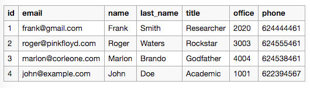
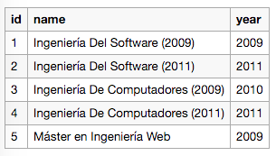
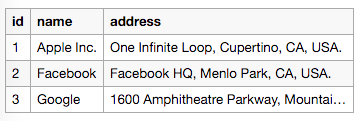
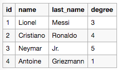
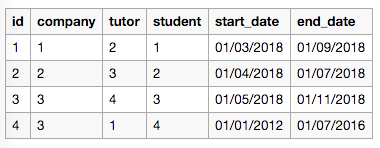

# Manual de Uso
En esta sección explicaremos la configuración del sistema y el uso la aplicación. Para poder explicar de forma más clara los conceptos y los pasos a seguir, se tomó la decisión de hacer el manual de usuario en formato tutorial. Para esto, plantearemos un caso práctico y lo iremos resolviendo con ayuda del sistema de gestión de datos.

El manual se divide en dos partes: la configuración básica y la configuración avanzada.

## Caso Práctico
Como caso práctico hemos elegido el ejemplo mencionado previamente en la sección de requisitos que habla de la gestión de prácticas externas universitarias. Un departamento universitario se encarga de mantener los datos y relaciones entre tutores, grados, empresas y estudiantes. Los datos se mantienen en archivos Excel y tienen la siguiente estructura:

**Tutores**


**Grados**


**Empresas**


**Estudiantes**


Además de estos datos también se mantiene un archivo con la relación de prácticas externas entre estudiantes, compañias y tutores. En este se registran las prácticas externas con su fecha de inicio y de finalización.

**Prácticas externas**


Como se puede apreciar, el mantenimiento de estos datos es totalmente manual y muy costoso. El departamento está buscando forma de automatizar este proceso en la mayor medida posible. Para esto eligen utilizar el sistema de gestión de datos definido en este proyecto.

El primer paso es convertir los datos a `.json`. Este paso es trivial ya que existen muchas herramientas en linea que convierten `.csv` a `.json`. Los datos después de la conversion son los siguientes*:

```
{
  "students": [
    {
      "id": 1,
      "name": "Lionel",
      "last_name": "Messi",
      "degree": 3
    },
    {
      "id": 2,
      "name": "Cristiano",
      "last_name": "Ronaldo",
      "degree": 4
    },
    ...
  ],
  "tutors": [
    {
      "id": 1,
      "email": "frank@gmail.com",
      "name": "Frank",
      "last_name": "Smith",
      "title": "Researcher",
      "office": 2020,
      "phone": null
    },
    {
      "id": 2,
      "email": "roger@pinkfloyd.com",
      "name": "Roger",
      "last_name": "Waters",
      "title": "Rockstar",
      "office": 3003,
      "phone": null
    },
    ...
  ],
  "degrees": [
    {
      "id": 1,
      "name": "Ingeniería Del Software (2009)",
      "year": 2009
    },
    {
      "id": 2,
      "name": "Ingeniería Del Software (2011)",
      "year": 2011
    },
    ...
  ],
  "companies": [
    {
      "id": 1,
      "name": "Apple Inc.",
      "address": "One Infinite Loop, Cupertino, CA, USA."
    },
    {
      "id": 2,
      "name": "Facebook",
      "address": "Facebook HQ, Menlo Park, CA, USA."
    },
    ...
  ],
  "internships": [
    {
      "id": 1,
      "company": 1,
      "tutor": 2,
      "student": 1,
      "start_date": 1519858800000,
      "end_date": 1535752800000
    },
    {
      "id": 2,
      "company": 2,
      "tutor": 3,
      "student": 2,
      "start_date": 1522533600000,
      "end_date": 1530396000000
    },
    ...
  ]
}
```
_* se muestran solamente las 2 primeras entradas de datos de cada entidad._

## Configuración Básica
Una vez convertidos los datos a `.json` se debe definir la estructura de cada entidad dentro del esquema de datos. Para esto debemos crear un archivo `.json` que por ahora llamaremos `esquema_de_datos.json`.
Este archivo contiene la configuración de la aplicación, la configuración de cada entidad de datos, y de la autenticación. Por ahora nos vamos a concentrar en las dos primeras opciones.

Para la configuración de la aplicación debemos definir: el nombre de la aplicación y el contenido de la página de inicio. El contenido se puede guardar en un archivo markdown o proporcionar directamente en el esquema de datos, por ahora lo mantendremos en el esquema de datos.

```
{
  "app": {
    "name": "Gestión de datos de prácticas externas universitarias",
    "home": {
      "content": "# Gestión de datos de prácticas externas universitarias \n Plataforma digital para la gestión de las prácticas en empresa de los alumnos de la universidad UPM."
    }
  },
  "entities": {...}
}
```

Ahora debemos configurar las entidades de datos, en total tenemos 5: Tutores, Estudiantes, Compañías, Grados y Prácticas Externas. Para esto utilizaremos el objeto _entities_ dentro del esquema de configuración. Cada clave dentro de este objeto equivale a una entidad de datos y su valor a las opciones de configuración. Las opciones que de momento definiremos son: encabezado y columnas. El encabezado representa el texto que se mostrará como encabezado el la página de entidad y columnas representa las propiedades de la entidad que se mostrarán como columnas en la tabla de consulta de datos.

```
{
  "app": {...},
  "entities": {
    "tutors": {
      "heading": "Gestionar Tutores",
      "columns": ["id", "name", "last_name", "email", "title", "office", "phone"]
    },
    "degrees": {
      "heading": "Gestionar Grados",
      "columns": ["id", "name", "year"]
    },
    "companies": {
      "heading": "Gestionar Empresas",
      "columns": ["id", "name", "address"]
    },
    "students": {
      "heading": "Gestionar Estudiantes",
      "columns": ["id", "name", "last_name", "degree"]
    },
    "internships": {
      "heading": "Gestionar Prácticas Externas",
      "columns": ["id", "company", "tutor", "student", "start_date", "end_date"]
    }
  }
}
```

