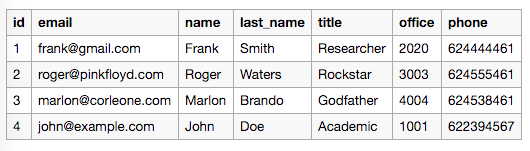
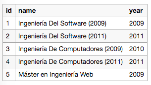
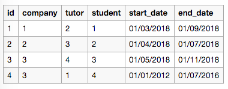

## Caso Práctico
Como caso práctico hemos elegido el ejemplo mencionado previamente en la sección de requisitos que habla de la gestión de prácticas externas universitarias. Un departamento universitario se encarga de mantener los datos y relaciones entre tutores, grados, empresas y estudiantes. Los datos se mantienen en archivos Excel y tienen la siguiente estructura:

**Tutores**


**Grados**


**Empresas**


**Estudiantes**


Además de estos datos también se mantiene un archivo con la relación de prácticas externas entre estudiantes, compañías y tutores. En este se registran las prácticas externas con su fecha de inicio y de finalización.

**Prácticas externas**


Como se puede apreciar, el mantenimiento de estos datos es totalmente manual y muy costoso. El departamento está buscando alguna forma de automatizar este proceso en la mayor medida de lo posible. Para esto eligen utilizar el sistema de gestión de datos definido en este proyecto.

El primer paso es convertir los datos a `.json`. Este paso es trivial ya que existen muchas herramientas en linea que convierten `.csv` a `.json`. Los datos después de la conversion son los siguientes*:

```
{
  "students": [
    {
      "id": 1,
      "name": "Lionel",
      "last_name": "Messi",
      "degree": 3
    },
    {
      "id": 2,
      "name": "Cristiano",
      "last_name": "Ronaldo",
      "degree": 4
    },
    ...
  ],
  "tutors": [
    {
      "id": 1,
      "email": "frank@gmail.com",
      "name": "Frank",
      "last_name": "Smith",
      "title": "Researcher",
      "office": 2020,
      "phone": null
    },
    {
      "id": 2,
      "email": "roger@pinkfloyd.com",
      "name": "Roger",
      "last_name": "Waters",
      "title": "Rockstar",
      "office": 3003,
      "phone": null
    },
    ...
  ],
  "degrees": [
    {
      "id": 1,
      "name": "Ingeniería Del Software (2009)",
      "year": 2009
    },
    {
      "id": 2,
      "name": "Ingeniería Del Software (2011)",
      "year": 2011
    },
    ...
  ],
  "companies": [
    {
      "id": 1,
      "name": "Apple Inc.",
      "address": "One Infinite Loop, Cupertino, CA, USA."
    },
    {
      "id": 2,
      "name": "Facebook",
      "address": "Facebook HQ, Menlo Park, CA, USA."
    },
    ...
  ],
  "internships": [
    {
      "id": 1,
      "company": 1,
      "tutor": 2,
      "student": 1,
      "start_date": 1519858800000,
      "end_date": 1535752800000
    },
    {
      "id": 2,
      "company": 2,
      "tutor": 3,
      "student": 2,
      "start_date": 1522533600000,
      "end_date": 1530396000000
    },
    ...
  ]
}
```
_* se muestran solamente las 2 primeras entradas de datos de cada entidad._