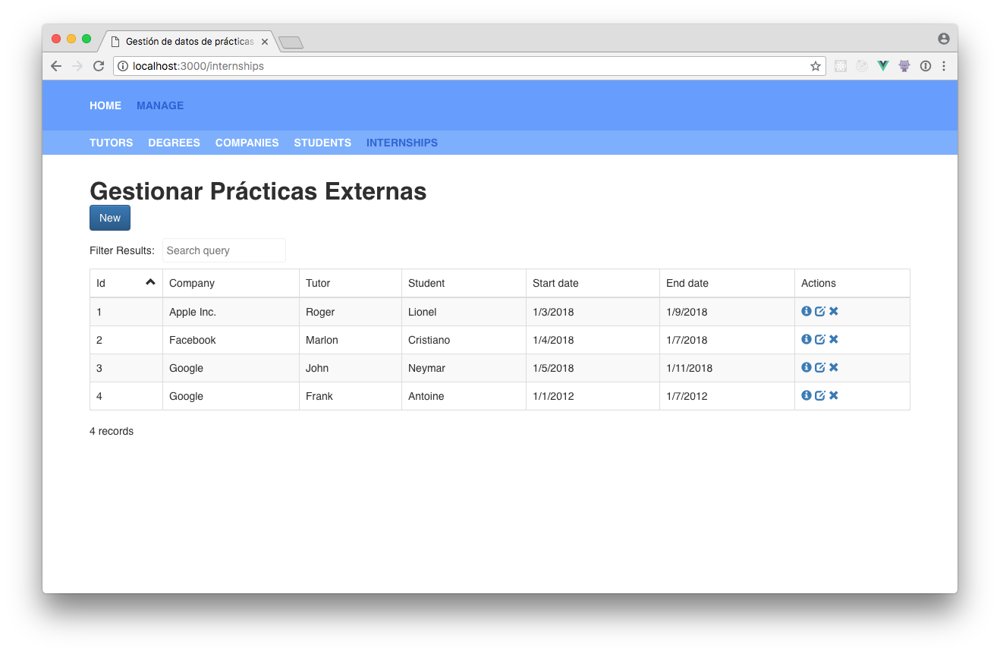
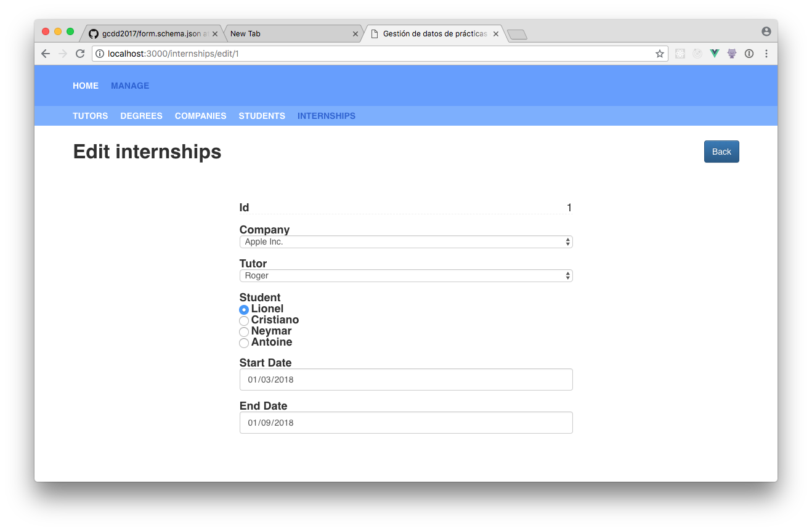
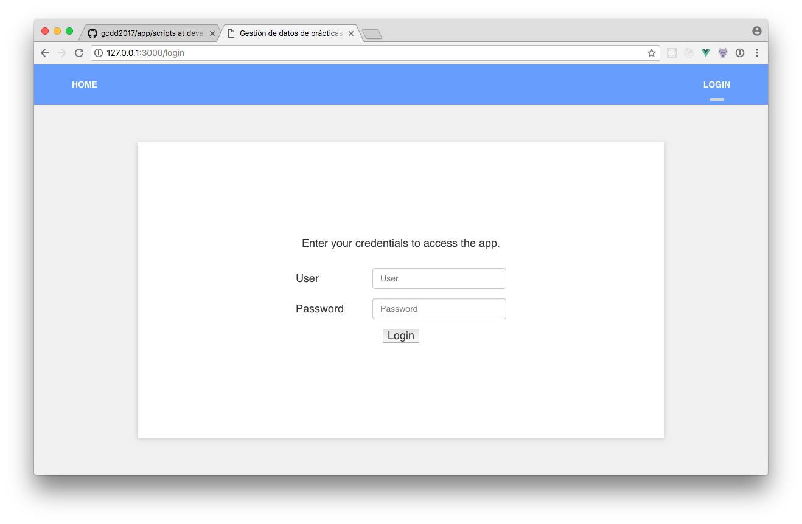
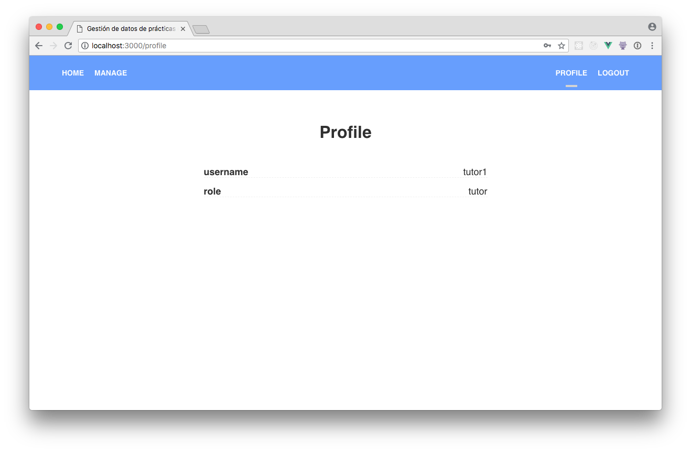

## Configuración Avanzada
En esta sección hablaremos de los casos de uso avanzados y como sacar el máximo provecho de los archivos de configuración.

### Esquema de tabla

En la sección anterior vimos como los datos que representan relaciones, no demostraban de forma clara con que estaban relacionados. Para solucionar esto añadiremos en el esquema de datos las siguientes opciones a las entidades que tengan alguna relación: `mapRelations` y `prefetch`.

- `mapRelations` es un valor booleano que activa el modo de mapeo de relaciones con entidades.
- `prefetch` es una lista que contiene el nombre de las entidades a descargar para poder hacer el mapeo de relaciones.

Añadiremos estas opciones a las entidades con relaciones: estudiantes y prácticas externas. De forma que nuestro esquema de datos queda de la siguiente forma.

```json
{
  "app": {...},
  "entities": {
    "tutors": {...},
    "degrees": {...},
    "companies": {...},
    "students": {
      "heading": "Gestionar Estudiantes",
      "columns": ["id", "name", "last_name", "degree"],
      "mapRelations": true,
      "prefetch": ["degrees"]
    },
    "internships": {
      "heading": "Gestionar Prácticas Externas",
      "columns": ["id", "company", "tutor", "student", "start_date", "end_date"],
      "mapRelations": true,
      "prefetch": ["companies", "tutors", "students"]
    }
  }
}
```

Sin embargo, esto no es suficiente. La aplicación no es lo suficientemente inteligente para saber que valor mostrar donde se muestra una clave foránea. Este mapeo lo tenemos que especificar nosotros. Para esto necesitamos crear un nuevo esquema que de momento llamaremos `esquema_de_tabla.json`.

En este esquema describiremos la forma de hacer el mapeo de relaciones por cada entidad que tenga `mapRelations` como verdadero.

```json
{
  "students": {
    "degree": {
      "relation": { "key": "name", "name": "degrees" }
    }
  },
  "internships": {
    "company": {
      "relation": { "key": "name",  "name": "companies" }
    },
    "student": {
      "relation": { "key": "name", "name": "students" }
    },
    "tutor": {
      "relation": { "key": "name", "name": "tutors" }
    }
  }
}
```
Dentro de cada entidad añadimos un objeto por cada propiedad que representa una relación, y dentro de esta propiedad añadimos una propiedad `relation` que contiene una clave (`key`) que corresponde al valor y un nombre (`name`) que corresponde a la entidad con la que esta relacionada.

Después de estos cambios volvemos a ejecutar el script `npm run generate`, solo que esta vez añadiremos nuestro nuevo esquema en la cuarta pregunta.
Al ejecutar la aplicación veremos que donde había claves foráneas ahora hay nombres, ahora es más comprehensible. Pero en la tabla de prácticas externas aún hay dos columnas sin sentido: fecha de inicio y fecha de finalización.

Las fechas en el sistema se manejan en formato UNIX, este formato no es muy amigable de cara al usuario. Para solucionar este problema podemos añadir la opción `format` al esquema de tabla.

```json
{
  "students": {...},
  "internships": {
    "company": {...},
    "student": {...},
    "tutor": {...},
    "start_date": {
      "format": ["es-ES", null, true]
    },
    "end_date": {
      "format": ["es-ES", null, true]
    }
  }
}
```
La opción de `format` recibe una lista que contiene 3 argumentos. Los primeros dos argumentos coinciden con los de los métodos de javascript `toLocaleString` y `toLocaleDateString`. El primero representa el idioma de localización, el segundo un objeto de opciones. El tercer argumento es un valor booleano que determina si el valor representa una fecha o no.

Al hacer estos cambios, podemos ver que las fechas y las relaciones se muestran de manera correcta.



### Esquema de formulario

Con este nuevo esquema podemos controlar la presentación de los datos en la tabla de consulta de datos. ¿Pero qué hay del formulario donde se crean y editan los datos?

Este formulario, deduce el tipo del campo de datos dependiendo del tipo de datos de cada propiedad. Sin embargo, hay casos en los queremos utilizar un campo de datos complejo. Estos campos no se pueden deducir, por lo que tenemos que especificarlos en algún lado.
Para esto crearemos un nuevo archivo llamado `esquema_de_formulario.json`.

Llamamos campos de datos complejos a todo campo dentro del formulario que contenga más de un valor a la vez, y/o que de cara al usuario muestre un valor (etiqueta), mientras que internamente para la aplicación se use otro (valor).

El esquema de formulario tiene dos funciones principales. La primera es especificar que tipo de campo de datos utilizar en alguna propiedad de la entidad. La segunda función es describir la forma de hacer el mapeo de relaciones en los campos del formulario.

```json
{
  "internships": {
    "company": {...},
    "tutor": {
      "type": "select",
      "relation": {
        "key": "values",
        "name": "tutors"
      },
      "selectOptions": {
        "name": "name"
      }
    },
    "student": {
      "type": "radios",
      "relation": {
        "key": "values",
        "name": "students"
      },
      "radiosOptions": {
        "name": "name",
        "value": "id"
      }
    },
    "start_date": {...},
    "end_date": {
      "type": "input",
      "inputType": "date",
      "validator": "date"
    }
  },
  "students": {
    "degree": {
      "type": "select",
      "relation": {
        "key": "values",
        "name": "degrees"
      },
      "selectOptions": {
        "name": "name"
      }
    }
  }
}

```

Al igual que en el `esquema_de_tabla.json`,  se añade un objeto por cada entidad de datos que necesite configuración y dentro cada propiedad a configurar. Lo que cambia son las opciones de configuración de las propiedades. Aquí se puede definir el tipo de campo, el mapeo de relaciones y las opciones extras en caso de ser un campo de datos complejo.

- **Tipo de datos.** Puede ser `input`, `select`, `radios`, `checkbox`, `checklist` y `textArea`. En caso de ser `input` se debe especificar el tipo de input mediante la propiedad `inputType`.
- **Relación.** Un objeto que contiene dos propiedades: clave (`key`) y nombre (`name`). La clave representa donde se encuentran los valores a utilizar y el nombre representa la entidad con la que está relacionada.
- **Opciones.** Es un objeto que incluye las opciones del campo de datos. Solo disponible en campos de datos complejos, y se llama `tipo de datos` + `Options`. En esta se encuentra la propiedad nombre (`name`), que establece que propiedad mostrar como valor de cara al usuario.



### Autenticación
Finalmente, para el sistema de gestión de las prácticas externas se desea que los profesores puedan registrar sus datos y los de las prácticas que supervisan. De igual forma, se quiere que los estudiantes y las compañías puedan registrarse en la aplicación. Sin embargo, ni los estudiantes, ni los profesores, ni las empresas deben de poder modificar o añadir datos de los demás actores.
Además se quiere poder compartir la página de consulta de las prácticas externas en modo lectura con cualquier persona, incluso si no ha iniciado sesión.

Para poder soportar estos casos de uso es necesario añadir la opción de `auth` al esquema de datos.
Esta opción contiene dos propiedades: `request`y `response`.
La primera contiene una url con la cual autenticarse, el nombre de la propiedad usuario y el nombre de la propiedad contraseña dentro de la petición de autenticación.
La segunda contiene el nombre de la propiedad donde se encuentran los datos del usuario autenticado.

En un caso de la vida real, el url apuntaría a un servidor que contuviera los datos de los usuarios de la universidad. Pero en este ejemplo, guardaremos los datos dentro de nuestro archivo de datos local.

```json
{
  "users": [
    {
      "id": 1,
      "username": "tutor1",
      "password": "password_tutor",
      "role": "tutor"
    },
    {
      "id": 2,
      "username": "student1",
      "password": "password_student",
      "role": "student"
    },
    {
      "id": 3,
      "username": "company1",
      "password": "password_company",
      "role": "company"
    }
  ],
  "tutors": {...},
  "students": {...},
  "companies": {...},
  "degrees": {...},
  "internships": {...},
}
```

Ahora debemos actualizar el `esquema_de_datos.json`. Añadiremos la configuración de autenticación, pero además debemos añadir la configuración de permisos mediante roles. Estableceremos que acciones puede hacer cada rol en cada entidad mediante: `showCreate`, `showEdit` y `showDelete`.
Por último añadimos el nivel de acceso a cada entidad por parte del público no autenticado mediante `auth`.

```json
 "app": {...},
  "entities": {
    "tutors": {
      ...
      "auth": true,
      "showCreate": { "path": "role", "value": "tutor" },
      "showEdit": { "path": "role", "value": "tutor" },
      "showDelete": { "path": "role", "value": "tutor" }
    },
    "degrees": {
      ...
      "auth": true,
      "showCreate": { "path": "role", "value": "tutor" },
      "showEdit": { "path": "role", "value": "tutor" },
      "showDelete": { "path": "role", "value": "tutor" }
    },
    "companies": {
      ...
      "auth": true,
      "showCreate": { "path": "role", "value": "company" },
      "showEdit": { "path": "role", "value": "company" },
      "showDelete": { "path": "role", "value": "company" }
    },
    "students": {
      ...
      "auth": true,
      "showCreate": { "path": "role", "value": "students" },
      "showEdit": { "path": "role", "value": "students" },
      "showDelete": { "path": "role", "value": "students" }
    },
    "internships": {
      ...
      "auth": false,
      "showCreate": { "path": "role", "value": "tutor" },
      "showEdit": { "path": "role", "value": "tutor" },
      "showDelete": { "path": "role", "value": "tutor" }
    }
  },
  "auth": {
    "request": {
      "url": "/auth",
      "user": "username",
      "password": "password"
    },
    "response": {
      "payload": "data"
    }
  }
}
```

De forma que con esto la aplicación queda protegida mediante un inicio de sesión, y solamente la página de prácticas externas es visible para los usuarios sin sesión.



