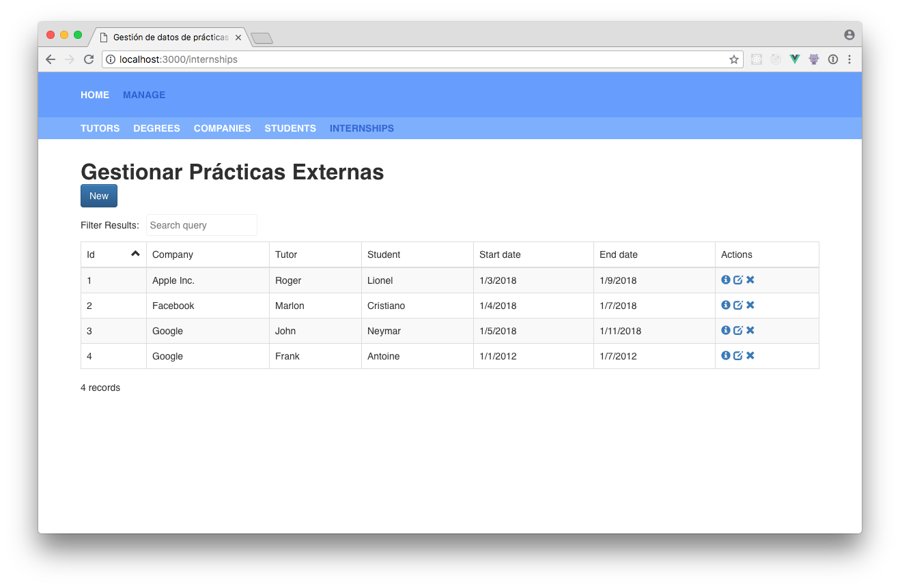

## Configuración Avanzada
En esta sección hablaremos de los casos de uso avanzados y como sacar el máximo provecho de los archivos de configuración.

En la sección anterior vimos como los datos que representan relaciones, no demostraban de forma clara con que estaban relacionados. Para solucionar esto añadiremos en el esquema de datos las siguientes opciones a las entidades que tengan alguna relación: `mapRelations` y `prefetch`.

- `mapRelations` es un valor booleano que activa el modo de mapeo de relaciones con entidades.
- `prefetch` es una lista que contiene el nombre de las entidades a descargar para poder hacer el mapeo de relaciones.

Añadiremos estas opciones a las entidades con relaciones: estudiantes y prácticas externas. De forma que nuestro esquema de datos queda de la siguiente forma.

```json
{
  "app": {...},
  "entities": {
    "tutors": {...},
    "degrees": {...},
    "companies": {...},
    "students": {
      "heading": "Gestionar Estudiantes",
      "columns": ["id", "name", "last_name", "degree"],
      "mapRelations": true,
      "prefetch": ["degrees"]
    },
    "internships": {
      "heading": "Gestionar Prácticas Externas",
      "columns": ["id", "company", "tutor", "student", "start_date", "end_date"],
      "mapRelations": true,
      "prefetch": ["companies", "tutors", "students"]
    }
  }
}
```

Sin embargo, esto no es suficiente. La aplicación no es lo suficientemente inteligente para saber que valor mostrar donde se muestra una clave foránea. Este mapeo lo tenemos que especificar nosotros. Para esto necesitamos crear un nuevo esquema que de momento llamaremos `esquema_de_tabla.json`.

En este esquema describiremos la forma de hacer el mapeo de relaciones por cada entidad que tenga `mapRelations` como verdadero.

```json
{
  "students": {
    "degree": {
      "relation": { "key": "name", "name": "degrees" }
    }
  },
  "internships": {
    "company": {
      "relation": { "key": "name",  "name": "companies" }
    },
    "student": {
      "relation": { "key": "name", "name": "students" }
    },
    "tutor": {
      "relation": { "key": "name", "name": "tutors" }
    }
  }
}
```
Dentro de cada entidad añadimos un objeto por cada propiedad que representa una relación, y dentro de esta propiedad añadimos una propiedad `relation` que contiene una clave (`key`) que corresponde al valor y un nombre (`name`) que corresponde a la entidad con la que esta relacionada.

Después de estos cambios volvemos a ejecutar el script `npm run generate`, solo que esta vez añadimos nuestro nuevo esquema en la cuarta pregunta.
Al ejecutar la aplicación veremos que donde había claves foráneas ahora hay nombres, ahora es más comprehensible. Pero en la tabla de prácticas externas aún hay dos columnas sin sentido: fecha de inicio y fecha de finalización.

Las fechas en el sistema se manejan en formato UNIX, este formato no es muy amigable de cara al usuario. Para solucionar este problema podemos añadir la opción `format` al esquema de tabla.

```json
{
  "students": {...},
  "internships": {
    "company": {...},
    "student": {...},
    "tutor": {...},
    "start_date": {
      "format": ["es-ES", null, true]
    },
    "end_date": {
      "format": ["es-ES", null, true]
    }
  }
}
```
La opción de `format` recibe una lista que contiene 3 argumentos. Los dos argumentos coinciden con los métodos de javascript `toLocaleString` y `toLocaleDateString`. El primero representa el idioma de localización, el segundo un objeto de opciones y el tercero es un valor booleano que determina si el valor representa una fecha o no.

Al hacer estos cambios, podemos ver que las fechas y las relaciones se muestra de manera correcta.

