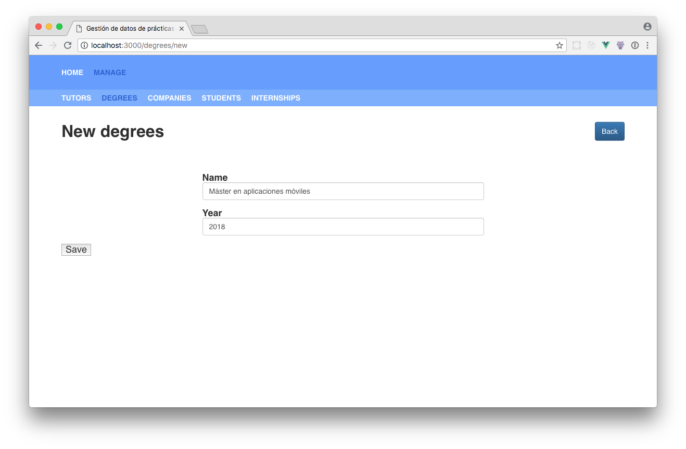

## Configuración Básica
Una vez convertidos los datos a `.json` se debe definir la estructura de cada entidad dentro del esquema de datos. Para esto debemos crear un archivo `.json` que por ahora llamaremos `esquema_de_datos.json`.
Este archivo contiene la configuración de la aplicación, la configuración de cada entidad de datos, y de la autenticación. Por ahora nos vamos a concentrar en las dos primeras opciones.

Para la configuración de la aplicación debemos definir: el nombre de la aplicación y el contenido de la página de inicio. El contenido se puede guardar en un archivo markdown o proporcionar directamente en el esquema de datos, por ahora lo mantendremos en el esquema de datos.

```
{
  "app": {
    "name": "Gestión de datos de prácticas externas universitarias",
    "home": {
      "content": "# Gestión de datos de prácticas externas universitarias \n Plataforma digital para la gestión de las prácticas en empresa de los alumnos de la universidad UPM."
    }
  },
  "entities": {...}
}
```

Ahora debemos configurar las entidades de datos, en total tenemos 5: Tutores, Estudiantes, Compañías, Grados y Prácticas Externas. Para esto utilizaremos el objeto _entities_ dentro del esquema de configuración. Cada clave dentro de este objeto equivale a una entidad de datos y su valor a las opciones de configuración. Las opciones que de momento definiremos son: encabezado y columnas. El encabezado representa el texto que se mostrará como encabezado en la página de entidad y columnas representa las propiedades de la entidad que se mostrarán como columnas en la tabla de consulta de datos.

```
{
  "app": {...},
  "entities": {
    "tutors": {
      "heading": "Gestionar Tutores",
      "columns": ["id", "name", "last_name", "email", "title", "office", "phone"]
    },
    "degrees": {
      "heading": "Gestionar Grados",
      "columns": ["id", "name", "year"]
    },
    "companies": {
      "heading": "Gestionar Empresas",
      "columns": ["id", "name", "address"]
    },
    "students": {
      "heading": "Gestionar Estudiantes",
      "columns": ["id", "name", "last_name", "degree"]
    },
    "internships": {
      "heading": "Gestionar Prácticas Externas",
      "columns": ["id", "company", "tutor", "student", "start_date", "end_date"]
    }
  }
}
```

Con estos datos ya podemos empezar a utilizar el sistema, el único paso pendiente es copiar los datos y el esquema de datos dentro del sistema. Para esto utilizaremos la herramienta de línea de comando. Debemos ejecutar el siguiente comando desde la raíz de proyecto `npm run generate` y después solo hace falta seguir las instrucciones.

Como solamente estamos interesados en copiar el esquema de datos y los datos de las entidades, ignoramos las ultimas tres preguntas.


Al finalizar este proceso podemos arrancar la aplicación. Podremos observar que la página de inicio muestra el contenido que hemos especificado.


Además si visitamos las páginas de entidades podemos ver que los datos que antes se encontraban en los archivos excel ahora se muestran en la aplicación.





Sin embargo, sí nos fijamos en los datos. Se puede apreciar que en muchos casos no son muy representativos (especialmente en la entidad prácticas externas). Esto es porque las columnas que representan una relación contienen los identificadores únicos que corresponden a otras entidades y no un valor reconocible. En la siguiente sección veremos como se puede mejorar esto.

